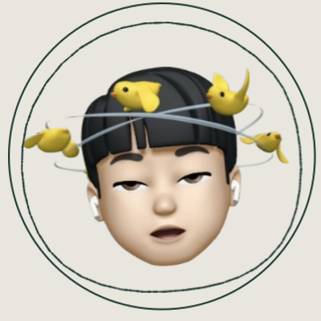

# 📢 NotiSKKU - 성균관대학교 공지사항 알림 서비스

NotiSKKU는 성균관대학교 학생들을 위한 **맞춤형 공지사항 알림 애플리케이션**입니다.

학과별, 키워드별로 공지사항을 받아보고, 중요한 공지를 즐겨찾기하며, 학사일정을 한눈에 확인할 수 있습니다.

### 더 이상 중요한 공지를 놓치지 마세요!
학과별 맞춤 공지부터 관심 키워드 알림까지, NotiSKKU와 함께 스마트한 대학 생활을 시작하세요.

실시간 푸시 알림으로 언제 어디서나 필요한 정보를 받아보실 수 있습니다.

  

 

## 🔥 This is Our Team

| 이채연 | 김예진 | 문준원 | 박준우 |
|:--:|:------:|:--------:|:-------:|
|  |  |  |  |
| 바이오메카트로닉스학과 | 교육학과 | 소프트웨어학과 | 소프트웨어학과 |
| [@i-chaeyeon](https://github.com/i-chaeyeon) | [@twjin03](https://github.com/twjin03) | [@mppn98](https://github.com/mppn98) | [@junwooP0](https://github.com/junwooP0) |

 

## 📲 지금 다운로드하세요!

  

 

## 📞 문의 및 피드백
서비스 관련 문의사항이나 개선 제안은 다음을 통해 연락해주세요:
- 📧 Email: notiskkuu@gmail.com
- 앱 내 피드백 기능 이용 (오픈채팅방으로 연결됩니다.)

## 🐱 To Contribute ..
- GitHub Issues: [Issues 페이지](https://github.com/Team-Notiskku/NotiSKKU/issues)

---
Made with ❤️ by Team NotiSKKU
